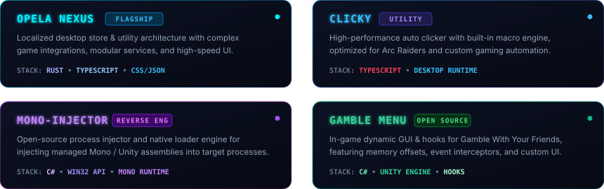
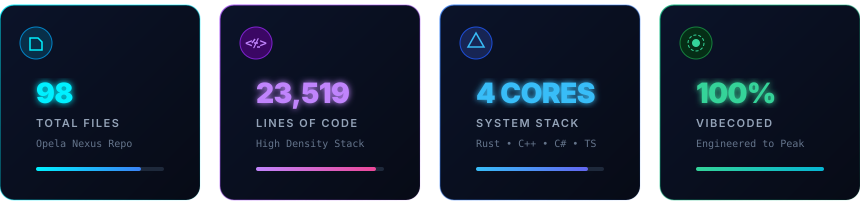
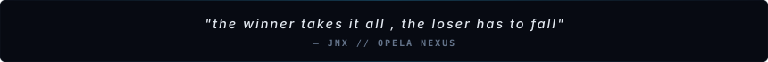

  

  

  
  
  
  

  

### ⚡ System Diagnostics & Environment

  

  

### 🛸 About Me

Welcome to my profile! I'm a developer and vibecoder driven by building robust applications, pushing low-level software architecture, and delivering high-polish user experiences. My work spans high-performance desktop software, game memory injection tooling, modern web ecosystems, and complex Discord bot architectures.

- 🛡️ **Software Architecture & Security**: Auditing, reversing, and hardening application runtimes, crafting modular architectures for performance and defensive integrity.
- 🖥️ **Desktop & Utilities Ecosystem**: Designing and developing **Opela Nexus** (a localized desktop store application with rich modularity), **Clicky** (specialized gaming automation & macro tool), and native loaders.
- 🕹️ **Reverse Engineering & Memory Tools**: Creating open-source game loaders like **Mono-Injector** and custom in-game UI menus with real-time memory hooks.
- 🤖 **Discord Bot Systems**: Building intricate Discord bots utilizing role-based access controls (RBAC) and customized game logic.
- 🌐 **Full-Stack Craftsmanship**: Handling everything from localized JSON data normalization and Discord API mapping to UI component styling and React / Next.js frontend design.

  

### 🚀 Featured Software & Tooling

  

| Project | Type | Description | Repository / Link |
| :--- | :--- | :--- | :--- |
| **Opela Nexus** | Desktop Suite | Flagship localized store & utility architecture (23.5k+ LOC) | [opela.team](https://opela.team/) |
| **Clicky** | Desktop Utility | High-speed auto clicker with built-in macro for Arc Raiders | [jynxzio5/Clicky](https://github.com/jynxzio5/Clicky) |
| **Mono-Injector** | Loader / Tool | Open-source managed Mono/Unity assembly injector | [jynxzio5/Mono-Injector](https://github.com/jynxzio5/Mono-Injector) |
| **Gamble Menu** | Game Tooling | Dynamic in-game UI and event hooks for Gamble With Your Friends | [jynxzio5/Gamble-with-friends-Menu](https://github.com/jynxzio5/Gamble-with-friends-Menu) |

  

### 📊 Opela Nexus Codebase Snapshot

  

  <strong>Opela Nexus spans 23,519 lines of code across 98 files</strong>, engineered across JSON, CSS, TypeScript, and Rust.

#### Top Core Languages

| Language | Files | Code Lines | Share |
| :--- | :---: | ---: | :--- |
|  **JSON** | 13 | 7,516 | `████████████░░░░░░░` 32.0% |
|  **CSS** | 20 | 6,774 | `███████████░░░░░░░░` 28.8% |
|  **TypeScript** | 29 | 4,955 | `████████░░░░░░░░░░░` 21.1% |
|  **Rust** | 19 | 3,421 | `█████░░░░░░░░░░░░░░` 14.5% |
|  **C++** | 1 | 487 | `█░░░░░░░░░░░░░░░░░░` 2.1% |

#### Auxiliary Stack

| Language | Files | Code Lines | Language | Files | Code Lines |
| :--- | :---: | ---: | :--- | :---: | ---: |
| **Markdown** | 1 | 92 | **PowerShell** | 1 | 43 |
| **C/C++ Header** | 3 | 71 | **HTML** | 2 | 33 |
| **JavaScript** | 3 | 63 | **XML** | 2 | 9 |
| **TOML** | 1 | 47 | **SVG** | 3 | 8 |

  <em>Signal from the stats: Dense TypeScript and CSS interface surface area backed by Rust native systems and structured data assets for a responsive, cross-language suite.</em>

  

### 🛠️ Languages & Arsenal

  

  
  
  
  

  

### 📈 Live GitHub Metrics & Activity

  

  

  

### 💬 Motto

  

  

